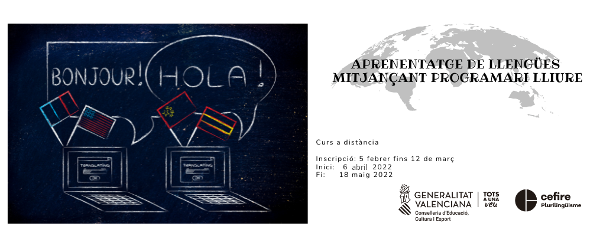
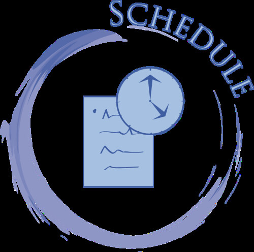

# Aprenentatge de llengües mitjançant programari lliure

## Benvinguda

El meu nom és Ferran Cunyat Pellicer, i soc professor tècnic de formació professional en l'especialitat de sistemes i aplicacions informàtiques a l'IES Jaume II "El Just" de Tavernes de la Valldigna. 

Us done la benvinguda al curs d'Aprenentatge d'idiomes mitjançant software lliure. Seré la persona encarregada d'ajudar-vos en aquest curs, que espere que complisca les vostres expectatives. No em considere un expert en la matèria, sinó una persona que utilitza aquestes ferramentes en el seu dia a dia per produir recursos que puguen resultar més atractius als seus alumnes, i és per això, que compartiré la meua experiència amb vosaltres.

## Contingut

- **^^Unitat 0:^^ Edició del perfil i presentació**

    Aquesta primera unitat no té contingut, simplement és una unitat inicial on les tasques a realitzar seran entrar a Aules a editar el teu perfil i presentar-te al fòrum de presentacions.
  

- **^^Unitat 1:^^ Creació de recursos H5P**

    En aquesta primera unitat, coneixerem les possibilitats que tenen els recursos digitals interactius H5P, fent ús d'imatges, vídeo i àudio editat per tercers ... En la resta d'unitats, incorporarem les nostres pròpies imatges, vídeos i àudios a la creació de recursos H5P.

- **^^Unitat 2:^^ Eines d'edició d'imatge**
    
    En aquesta unitat es treballarà amb eines d'edició gràfica per tal d'aprendre els passos bàsics necessaris per ser capaç d'editar o crear una imatge des de zero, eliminar objectes o parts d'imatges no desitjades, inserir textos, canviar colors ... 

- **^^Unitat 3:^^ Eines d'edició d'àudio**
    
    En aquesta unitat treballarem amb editors d'àudio que ens permetran ser capaços de realitzar gravacions i edicions sonores. Aprendrem a eliminar o silenciar fragments, aplicar filtres per a, per exemple, suprimir so de fons, amplificar algun fragment, manipular els canals per on s'emetrà el resultat final ...

- **^^Unitat 4:^^ Eines d'edició de vídeo**

    Finalment treballarem amb eines d'edició de vídeo que ens permetran produir els nostres clips multimèdia. Aprendrem a fer captures de vídeo de l'escriptori o de la webcam, superposar elements sobre la imatge, modificar els àudios, exportar en diferents formats i resolucions segons l'ús que li donarem ...

- **^^Unitat 5:^^ Revisió de treballs i entregues**
    
    Aquesta última unitat servirà per recopilar i compartir, sempre sota el consentiment dels autors, alguns treballs que puguen resultar interessants a la resta de participants del curs. Així cada participant podrà agafar idees dels treballs produïts per la resta dels companys i aplicar aquestes idees a les seues classes.

Totes les ferramentes utilitzades per a desenvolupar les tasques seran de **Software Lliure**. A més, aprendrem com integrar tots els recursos que generem a aules, com els podem compartir i avaluar.

!!! info Contingut 

    No és un contingut tancat, així que pot sofrir algunes modificacions segons avance el curs. Si considereu que seria interessant que s'explicara alguna ferramenta en concret us podeu posar en contacte amb mi a través de la plataforma aules i ho valorem.

## Temporització

<figure markdown>
  { width="200" }
  <figcaption>"Schedule" de IamGoodwine. CC BY-NC 2.0</figcaption>
</figure>

El curs es desenvoluparà entre el **6 d'abril** i el **18 de maig** de 2022. El contingut s'estructurarà en **quatre unitats principals més dues unitats, la zero i la cinc, sense contingut**. El període comprés entre els 16 i el 18 de maig, es deixa a manera de recopilació de tasques, mostra de treballs dels participants, entrega de tasques endarrerides, breu explicació d'algun concepte sobre el qual hi ha dubtes...

Tingueu en compte que tenim les vacances de Pasqua entre aquestes dates, i durant alguns dies gaudirem d'un merescut descans. Totes les unitats no tenen la mateixa durada, ja que l'edició de vídeo és més tediosa que la creació d'altres tipus de recursos.

Per tant, les dates quedaren com s'indica a continuació:

- **Unitat 0**: 6 - 8 d'abril.
- **Unitat 1:** 6 - 18 d'abril.
- **Unitat 2:** 19 d'abril - 27 d'abril.
- **Unitat 3:** 28 d'abril - 4 de maig.
- **Unitat 4:** 5 - 15 de maig.
- **Unitat 5:** 16 - 18 maig.

## Metodologia

La forma de treballar durant el curs serà **principalment pràctica**. Disposareu d'una sèrie de recursos, sobretot vídeos, amb explicacions de conceptes i exemples de com desenvolupar algun recurs. 

Els **recursos** de cada unitat es publicaran el **primer dia de cada unitat**. Quan estiguen disponibles us posaré un avís al fòrum *Avisos* de la plataforma Aules. No cal entrar a veure si s'ha posat l'avís, ja que **se us notificarà a través del correu electrònic** per estar subscrits al fòrum d'avisos de forma obligatòria. 

!!! warning "Reviseu el correu al perfil d'aules"

    Aquest és un dels motius de per què heu d'assegurar-vos que el correu electrònic que teniu configurat al perfil d'aules és correcte.

Hi haurà **una entrega per unitat**, on haureu de posar en pràctica els coneixements que aneu adquirint amb la lectura o visualització dels recursos. Es tractarà de generar recursos per als vostres alumnes i lliurar-los, **l'últim dia de la unitat a tot tardar**.

!!! tip "Entrega de tasques fora de plaç"

    Encara que les entregues estan programades en una data en concret, romandran obertes per a entregues fora de termini. No obstant això, recomenem que es vagen entregant en els plaços establerts per tal que no s'acumulen totes a la finalització del curs i resulte inabastable la seua realització.

## Avaluació

<figure markdown>
  { width="200" }
</figure>

Per tal de superar el curs i obtenir el certificat és necessari haver entregat i superar totes les tasques del curs.

Les tasques seran avaluades com a fet o no fet. 

## Fòrum de dubtes

Dins de cada unitat, disposareu d'un fòrum, on podeu plantejar qualsevol qüestió que se us presente, explicar alguna dificultat que heu trobat i que pot ser d'ajuda a altres companys, comentar alguna ferramenta o utilitat que heu descobert relacionada amb la unitat ...

Es tracta d'aprendre uns d'altres i compartir el coneiximent que es va adquirint per millorar entre tots l'educació dels nostres alumnes.

!!! cite "I recordeu ..."

    "Hi ha preguntes ingènues, preguntes tedioses, preguntes mal formulades, preguntes fetes després d'una autocrítica inadequada. Però cada pregunta és un crit per entendre el món. No hi ha una pregunta estúpida". 
    
    Carl Sagan