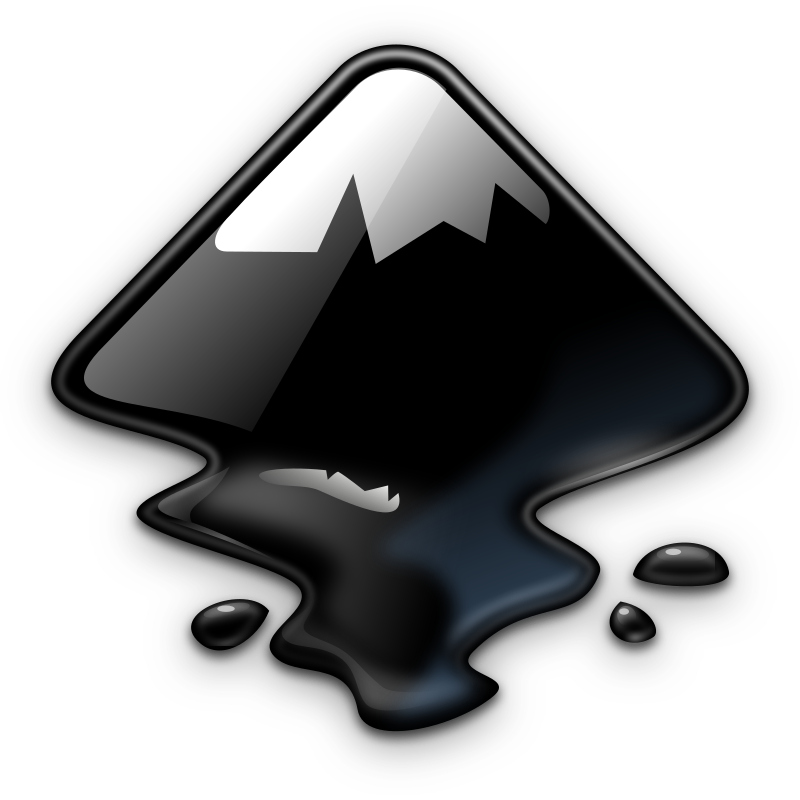

## Introducció a Inkscape
<figure markdown>
  { width="300" }
  <figcaption>Logo d'inkscape</figcaption>
</figure>

Ja hem vist que les imatges vectorials defineixen una imatge mitjançant objectes geomètrics, com línies, corbes i polígons, i ens permeten descriure el seu aspecte de manera independent a la resolució del dispositiu d’eixida. D’aquesta manera, podem ampliar les imatges tant com desitgem sense que es produïsquen pèrdues de qualitat.

Inkscape és un editor de gràfics vectorials multiplataforma (GNU/Linux, MacOS, Windows), utilitzat per al disseny de diagrames, logotipus, infografies o il·lustracions, entre d’altres. Es tracta de programari lliure, i actualment es troba a la versió 1.1.2.

El format d'arxiu per defecte utilitzat per Inkscape és l’SVG (Scalable Vetor Graphics), un estàndard obert de la W3C, tot i que permet exportar els dissenys a format de mapa de bits PNG, JPG, TIFF o WebP ajustat a qualsevol resolució.

El següent vídeo et servirà com a introducció a inkscape. S'explica l’entorn de treball, com fer algunes operacions bàsiques amb formes, tipografies, transformacions o camins, com exportar la imatge vectorial a mapa de bits...

!!! tip "Introducció a inkscape"

    Ves provant cadascuna de les coses que va explicant i pregunta als fòrums en cas que alguna cosa no et quede clara. No cal dominar de cop totes les opcions.

!!! tip "Documentació d'inkscape"

    Al següent enllaç tens la [documentació oficial d'inkscape](https://inkscape-manuals.readthedocs.io/en/latest/) (sols disponible en anglès).

