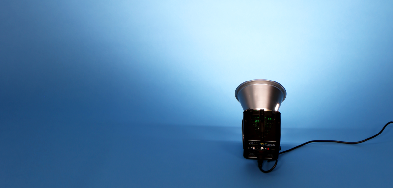
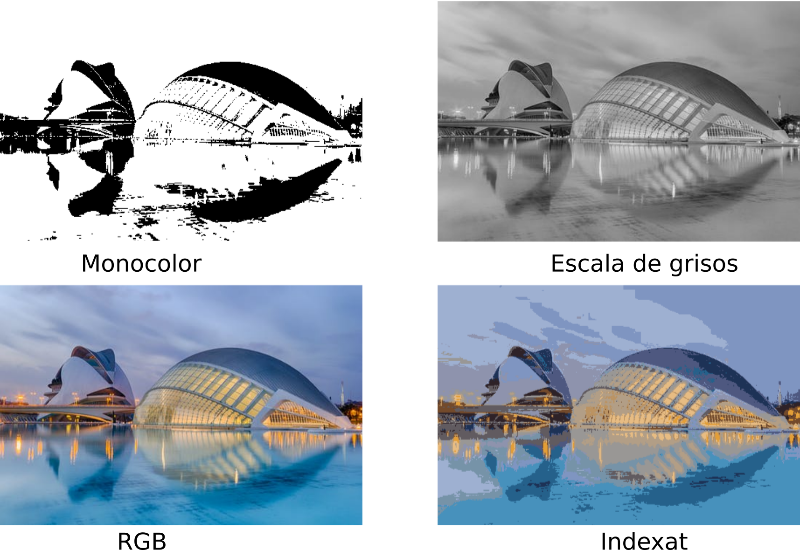
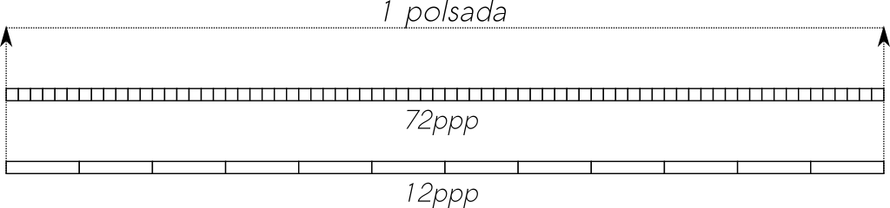

## La importància de la imatge digital

Els éssers humans estem programats biològicament per percebre el món d’una forma visual. Entenem una imatge molt millor que un text, i tenim molta més capacitat per retenir el contingut visual que altre tipus d’informació.

Per aquest motiu, la imatge juga un paper de gran importància en àmbits com la publicitat, la comunicació, o l’educació. Una idea es transmet molt millor si va acompanyada d’una imatge.

Per tot això, cada vegada és més important tenir habilitats en el seu tractament i edició, així com disposar d’eines que ens ajuden en aquesta tasca.

En aquesta unitat utilitzarem Inkscape, un editor d'imatge vectorial amb llicència de programari lliure, pensat per a l’elaboració de diagrames, logotipus o infografies.

Abans de començar a treballar amb aquestes eines, anem a veure alguns conceptes bàsics sobre imatge digital.

## Conceptes d’imatge digital

Podem definir una imatge digital com una representació d’una imatge composta per píxels organitzats en una graella de dues dimensions.

Però què és un píxel? El terme píxel prové de l’acrònim anglès picture element i representa la unitat mínima d’informació que podem representar d’una imatge digital. Un píxel serà cadascun dels punts que formen la imatge digital, i contindrà la informació necessària, per representar el color d’aquest.

Una imatge digital serà doncs susceptible de ser tractada mitjançant un equip informàtic, de manera que:

- Pot obtenir-se a partir de dispositius d’entrada analògica-digital (escàners i càmeres),
- Pot mostrar-se en pantalla o imprimir-se,
- Pot crear-se i processar-se mitjançant programes editors de mapes de bits, dibuix vectorial o renderització a 3D.
- Pot emmagatzemar-se en dispositius d’emmagatzemament.

Internament, una imatge digital conté una capçalera (conjunt d’informació a l’inici) amb propietats de la imatge (dimensions, codificació…) i després conté la informació en si de la imatge. Cada format defineix una estructura per als atributs i les dades d’aquesta. A més, alguns dispositius, com les càmeres digitals, inclouen als seus formats metadades com l’escala de sensibilitat, el flash, o fins i tot la ubicació en què s’ha pres la imatge.

A grans trets, les imatges digitals poden ser de dos grans tipus: Imatges de mapa de bits o imatges vectorials. En aquest curs ens centrarem en la imatge vectorial.

## Mapes de bits

Un mapa de bits (bitmap) és una graella rectangular de píxels o punts de color, anomenada matriu, i que es pot veure en un monitor o altre dispositiu de representació.

Aquestes imatges tenen una amplada i una alçada, expressades en píxels, i una profunditat de color, expressada en bits per píxel (quants bits s’utilitzen per determinar el color de cada píxel). A major profunditat de color, més colors diferents pot tindre un píxel, però major espai ocuparà en el sistema d'emmagatzematge.

Aquest format està amplament estès, i s’utilitza pe a la fotografia digital i la captura de vídeo.

## Imatges Vectorials

Les imatges vectorials defineixen una imatge mitjançant objectes geomètrics, com línies, corbes i polígons. Els gràfics vectorials permeten descriure la imatge de manera independent a la resolució del dispositiu d’eixida, i és per això que, podem ampliar les imatges indefinidament sense sofrir pèrdues de qualitat i que ens aparega pixelada.

Aquest format, per tal de poder-se representar en una pantalla ha de passar per un procés d'interpretació de la informació i poder-se representar en un mapa de bits ([tramatge](https://ca.wikipedia.org/wiki/Tramar)).

Així com els mapes de bits són més útils per a prendre fotografies o realitzar gravacions de vídeo, els gràfics vectorials són més utilitzats en el món del disseny (disseny tècnic, publicitari, imatge corporativa ...).

### Conversions entre mapes de bits i imatge vectorial

El procés de conversió d’un mapa de bits a vectors s’anomena vectorització. Pot fer-se de forma manual, calcant el bitmap amb corbes de Bezier o polígons vectorials, o bé de forma automàtica amb l'ajuda de les mateixes aplicacions de disseny. 

El procés invers és més senzill i s’anomena tramatge.

## Mode de color

Un altre concepte relacionat amb la imatge digital és el mode de color. El mode expressa la quantitat màxima de colors diferents que pot tindre un píxel, determinat per la seua profunditat de color de què ja hem parlat.

Alguns dels modes de color més utilitzats són:

- **Monocrom**: Té una profunditat de color d'1 bit, per la qual cosa la imatge només conté píxels blancs o negres.
- **Escala de grisos**: Utilitza només el canal negre, amb una profunditat de 8 bits, i per això obté fins a 2⁸=256 grisos diferents.
- **Mode RGB**: Utilitza 8 bits per cadascun dels tres canals corresponents al roig, verd i blau, i és per això que, cada pixel pot tindre 16,7 milions de colors diferents.
- **Mode indexat**: Utilitza una profunditat màxima de 8 bits, i per això només pot representar 256 colors. Amb aquest mode aconseguim reduir la grandària del fitxer mantenint una qualitat visual intermitja.

## Concepte de resolució

La resolució d’una imatge es defineix com un valor independent de la grandària de la imatge, que generalment es mesura en punts per polzada, i bàsicament representa la densitat de píxels per unitat lineal de mesura (polzada).

Així, com més píxels per polzada tinguem, la densitat serà major i per tant millorarà la qualitat i definició de la imatge, però evidentment, aquesta ocuparà més espai al dispositiu d’emmagatzemament.

!!! warning "Resolució en mapes de bits"

    El concepte de resolució sols té sentit en mapes de bits, ja que en imatge vectorial el procés de tramatge s'encarrega de redibuixar la imatge per a optimitzar la qualitat de la representació.

La modificació de la grandària d’una imatge de mapa de bits, implica un augment o increment del nombre de píxels, i per això caldrà decidir quin color té cada píxel en les noves dimensions. Aquest procés implicarà sempre una pèrdua de qualitat, sobretot quan fem una ampliació de la imatge, provocant un efecte pixelat de la nova imatge.

Generalment, les pantalles d’ordinador tenen entre 72 i 130 píxels per polzada (ppp). Pel que fa a les impressores, tot i que algunes poden imprimir fins a 2400 ppp, normalment una resolució de 150 a 300 ppp sol funcionar bé per imprimir amb bona qualitat.

## Formats d’imatge

Les imatges, tant vectorials com de mapa de bits poden emmagatzemar-se en diferents formats, cadascun d’ells amb determinades característiques.

Les imatges en format de mapa de bits poden ocupar grans quantitats de memòria, segons les seues dimensions i la profunditat en color.

Anem a veure un exemple. Una imatge en 4K (dimensions de 3840x2160 píxels), emmagatzemada amb una precisió o profunditat de color de 8 bits per canal (24 bits), ocuparia:

3840 * 2160 * 24 = 199.065.600 bits = 24.883.200 B = 24.300 KB = 23.7 MB

Tinguem en compte que per a aquest càlcul, la conversió de bits(b) a bytes(B) s’obté dividint la quantitat de bits per 8 (8b = 1B) i les equivalències 1 Kb=1024 bytes i 1 Mb=1024 Kb.

Com podem veure, 24 MB per a una imatge és una grandària considerable. Per aquest motiu, les imatges s’emmagatzemen de forma comprimida, de manera que arriben a ocupar bastant menys. Per exemple, la mateixa imatge comprimida en format PNG podria ocupar menys d'1 MB.

Existeixen dues grans famílies per als formats de compressió d’imatge de mapa de bits: els formats de compressió amb pèrdua (amb pèrdua d’informació en el procés de compressió) i sense pèrdua (sense pèrdua d’informació). 

!!! warning "Formats amb pèrdua i sense pèrdua"

    En els formats sense pèrdua, quan descomprimim la imatge obtenim la imatge original, mentre que amb la compressió amb pèrdua la imatge sofreix alguna degradació a canvi d’un major nivell de compressió.

### Formats de gràfics vectorials

| Format                                    | Característiques i usos                                                                                                                                                                  |
| :---------------------------------------- | :--------------------------------------------------------------------------------------------------------------------------------------------------------------------------------------- |
| SVG | És l'estàndard de facto, àmpliament utilitzat a la web i entre diferents programes d'edició d'imatges vectorials |
| PDF | Estàndard de facto utilitzat per a documents portables, també es pot utilitzar com a imatge vectorial |
| EPS | PostScript encapsulat, és un format d'arxiu de gràfics vectorials que permet seguir diversos esquemes de color com el RGB o el CMYK, però no permet canals alfa. Es tracta d'un arxiu PostScript que satisfà algunes restriccions addicionals per fer més fàcil la seva inclusió dins d'un altre document PostScript. L'arxiu és d'una sola pàgina i conté com a mínim un comentari BoundingBox, que descriu el rectangle que conté la imatge. Fou introduït per Adobe i és considerat un precedent del format PDF.|
| AI | És el format utilitzat pel programa Adobe Illustrator  |

### Formats de compressió de mapa de bits amb pèrdua

| Format                                    | Característiques i usos                                                                                                                                                                  |
| :---------------------------------------- | :--------------------------------------------------------------------------------------------------------------------------------------------------------------------------------------- |
| BMP (Bitmap)                              | No utilitza pràcticament cap mecanisme de compressió; simplement, guarda el valor de color per a cada píxel, i genera fitxers molt pesats. El format és pràcticament obsolet hui en dia. |
| JPEG (JPG-Joint Photograph Experts Group) | Àmpliament utilitzat i suportat a Internet i als navegadors web. No s’aconsella el seu ús en infografies o imatges on el text siga necessari                                             |

### Formats de compressió de mapa de bits sense pèrdua

| Format                                | Característiques i usos                                                                                                                                                                                                                                                                                                                                                                                           |
| :------------------------------------ | :---------------------------------------------------------------------------------------------------------------------------------------------------------------------------------------------------------------------------------------------------------------------------------------------------------------------------------------------------------------------------------------------------------------- |
| PNG (portable Network Graphics)       | Utilitzat per a infografies, bànners, captures de pantalla, i en general qualsevol gràfic que incloga imatge i text. Sol ser més pesat que el JPEG                                                                                                                                                                                                                                                                |
| GIF                                   | Tot i que no te pèrdua en la compressió, restringeix la profunditat del color a 8 bits, pel que només pot representar 256 colors. Sol utilitzar-se per a animacions menudes i fàcils d’utilitzar a Internet.                                                                                                                                                                                                      |
| TIFF (Tagged Image Format)            | Utilitzat per emmagatzemar imatges que després s’utilitzaran per a la impressió, ja que genera fitxers d’alta qualitat, a costa d’una elevada grandària de la imatge. Tot i que admet també compressió amb pèrdua, sol utilitzar-se com a format sense pèrdua.                                                                                                                                                    |
| RAW                                   | Es tracta d’un format d’imatge en brut, utilitzat per les càmeres digitals per tal d’emmagatzemar les imatges amb tota la qualitat pe a la seua posterior post-producció i edició. Utilitzen 14 bits en lloc de 8 per cada canal de color, amb el que es disposa de 16.384 tons per cadascun, donant més flexibilitat a l’hora d’ajustar colors i contrast. Evidentment, això generarà fitxers de major grandària |
| PSD                                   | Format propi d’Adobe Photoshop. Emmagatzema de forma separada capes, filtres, transparències, etc. de manera que són personalitzables i reversibles, pel que genera fitxers d’un volum considerable                                                                                                                                                                                                               |
| XCF (eXperimental Computing Facility) | És el format propi de Gimp, i seria l’equivalent al PSD. Emmagatzema capes, rutes, transparències, etc. a costa de generar fitxers de gran volum                                                                                                                                                                                                                                                                  |
| WebP                                  | Desenvolupat per Google específicament per oferir una millor compressió de la imatge tant sense pèrdues com amb pèrdues, i per reemplaçar els tipus JPEG i PNG. S’utilitza cada vegada més a Internet, ja que pot arribar a estalviar fins a un 35% d’espai amb la mateixa qualitat.                                                                                                                              |