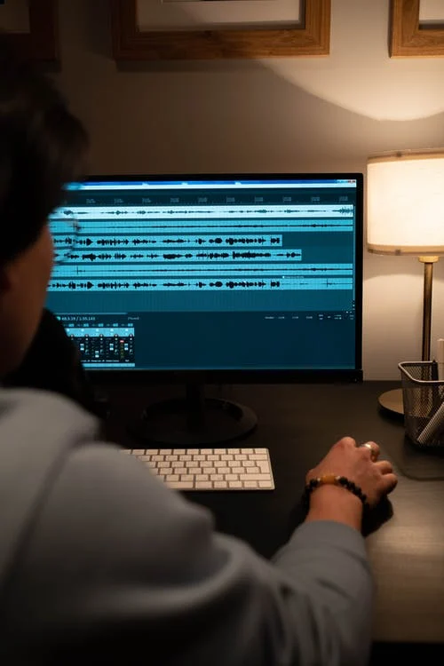
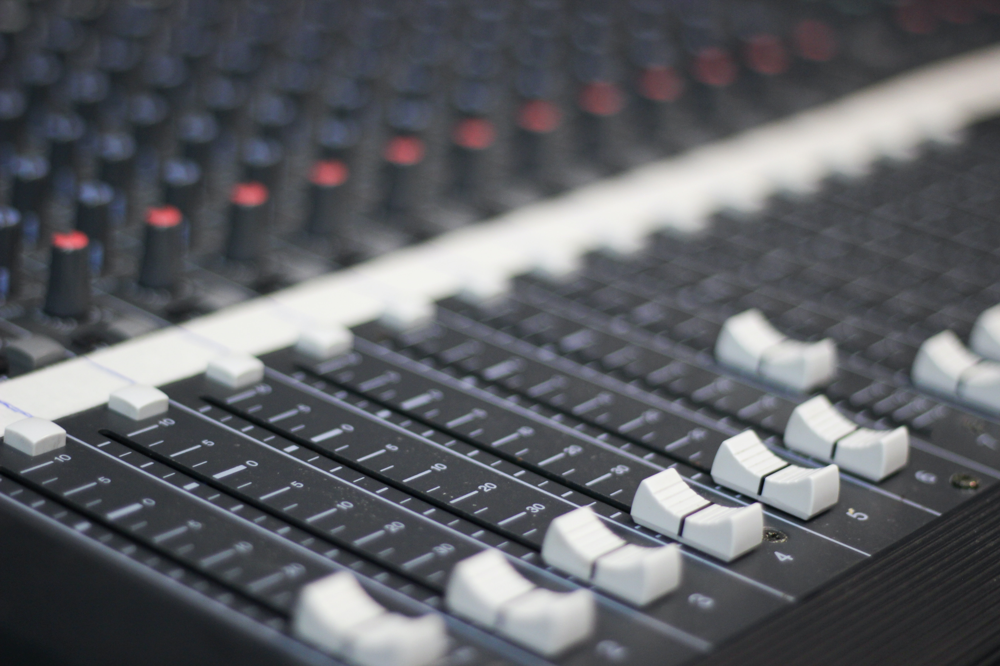

# Conceptes bàsics d'àudio digital

<figure markdown>
  
  <figcaption>Estudi de gravació professional</figcaption>
</figure>

Abans de començar amb l'edició d'àudio caldria tindre clars alguns conceptes bàsics sobre àudio digital.

## Concepte físic de so

El so està produït per la vibració d'un objecte emissor, com per exemple, les nostres cordes vocals quan parlem, la membrana d'un altaveu quan escoltem música, la corda d'una guitarra quan algú la polsa o un timbre quan algú acciona el seu mecanisme. Aquesta vibració es transmet en forma d'ona, provocada per canvis de pressió en el material, a través d'un canal de transmissió, normalment l'aire. Quan aquests canvis de pressió arriben al receptor, normalment els nostres oïts, el sistema auditiu transforma aquestes ones en informació que interpreta el nostre cervell, moment en el qual es produeix l'escolta.

## Qualitats del so

<figure markdown>
  
</figure>

Tradicionalment, s'han classificat els sons segons quatre característiques:

En funció de la **intensitat**, els sons poden ser *forts o dèbils*. És un concepte relacionat amb l'amplitut de l'ona, és a dir, amb la quantitat d'espai que recorre la vibració de l'emissor. A major amplitut, major intensitat.

El **to o l'altura** és la qualitat que ens permet diferenciar entre sons *aguts i greus*. És un concepte molt relacionat amb la freqüència, que veurem a continuació.

El **timbre** és la qualitat del so que ens permet *diferenciar qui ha produït el so* encara que la resta de qualitats siguen les mateixes. És a dir, gràcies al timbre del so podem determinar quin o quins instruments produeix una melodia encara que ho facen interpretant la mateixa melodia. 

La **duració** d'un so és l'interval temporal en el què el so s'està produint.

## Freqüència

Una forma d'analitzar el so és observar la velocitat amb què vibra l'emissor o l'ona que produeix a mesura que viatja per l'aire. El nombre de vegades que ocorre aquesta vibració per segon s'anomena "freqüència" del so i es mesura en Hertz (Hz) o quilohertz (KHz).

!!! info "Freqüència i to"

    Quan més alta és la freqüència d'un so, més agut el percibim.

!!! info "Freqüència i timbre"
    Normalment, el so no és una ona pura, sinó que és la suma de diferents ones formades per la vibració de l'emissor a diferents freqüències al mateix temps i a diferents intensitats cadascuna d'elles. Aquest fet provoca que el timbre de cada so siga diferent.

Es diu que l'orella humana és capaç d'escoltar sons en un rang que va des d'aproximadament els 20 Hz (20 vibracions per segon) fins a 20.000 Hz (20.000 vibracions per segon). A mesura que anem creixent, la capacitat d'escoltar les freqüències extremes, sobretot les més agudes, es van perdent, de forma que la gent més jove és capaç d'escoltar sons més aguts que la gent més major no percep. Les freqüències en la veu d'una persona poden oscil·lar entre els 300Hz i 3000Hz.

## Sonoritat, volum, amplitud, nivell i guany

Els termes de sonoritat, volum, amplitud i nivell signifiquen quasi el mateix. Com més volum li donem al so, més potència s'ha fet servir per crear-lo i sona més fort.

En ajustar el nivell de volum d'un so, per exemple, en utilitzar l'efecte amplificar d'Audacity, el valor del guany indica la quantitat d'augment o disminució del nivell. Aquest valor en una escala anomenada "decibels" o escala "dB", que ve a ser com la quantitat de potència que augmentem respecte al nivell mínim capaç de ser percebut per un humà. Per tant si ho posem a zero este deixant la mateixa potència, si és un valor positiu augmentarà la potència i per tant la intensitat del so, mentre que si és negatiu disminuirà.

L'orella humana pot escoltar sons de molt baixa a molt alta potència. No percebem les diferències de potència en proporció directa a la potència sinó de manera logarítmica, és a dir, que necessitem incrementar 10dB per a percebre un so el doble de fort. El mínim increment o decrement que una persona pot percebre està al voltant dels 3dB.

## So digital

<figure markdown>
  
</figure>

Quan volem enregistrar algun so de forma digital, és a dir, per a ser guardat o manipulat per un dispositiu electrònic, el receptor que utilitzem no són els nostres oïts, sinó que utilitzem un micròfon. El micròfon s'encarrega de transformar les vibracions en senyals elèctrics, normalment analògics, que posteriorment seran digitalitzats per la targeta de so del nostre ordinador o telèfon i guardats en un arxiu d'àudio. Posteriorment, aquest arxiu podrà ser manipulat i modificat per un editor d'àudio, que és el que aprendrem a fer en aquesta unitat. L'arxiu final serà guardat per a ser reproduït posteriorment a altres dispositius.

Es pot pensar en l'arxiu d'àudio com una representació de la pressió en la superfície del micròfon en diferents punts en el temps. Aquest procés de conversió d'àudio en una sèrie de números s'anomena "mostreig".

## Freqüència de mostreig
La freqüència de mostreig és el nombre de vegades que es pren la mesura de l'amplitud d'ona durant un segon.  Per exemple, en qualitat d'enregistrament de CD, l'equip emmagatzema 44100 números per segon, cadascun representant l'amplitud de l'ona captada en eixe moment del temps.

!!! tip "*Resolució de l'àudio*"
    Es pot pensar que la freqüència de mostreig d'un arxiu d'àudio és com la resolució en una imatge de mapa de bits. Per tant, com més alta freqüència de mostreig, més qualitat i més ocuparan els arxius.

A continuació, una guia ràpida sobre les freqüències de mostreig:

6000 - Molt baixa qualitat de veu
8000 - Veu de qualitat de telèfon
11025 - Veu de qualitat raonable - per exemple, dictats i *listenings*
22050 - Veu de bona qualitat, música de qualitat raonable - per exemple, CD multimèdia.
44100 - Alta qualitat, qualitat de CD d'àudio.

!!! tip "Selecció de la freqüència de mostreig"
    Quan graveu, utilitzeu la freqüència de mostreig que s'utilitzarà a l'arxiu final, perquè cada vegada que fem una conversió perdem un poc de qualitat. Per exemple - si volguerem gravar un CD de música utilitzariem 44100. Si volem crear un dicatat per als nostres alumnes, seria suficient amb 11025.

## Canals

<figure markdown>
  
  <figcaption>Taula de mescles amb molts canals</figcaption>
</figure>

Diversos "canals" d'àudio poden ser gravats alhora. El més comú és la gravació en "estèreo" en dos canals (dreta i esquerra) amb què les nostres orelles ens donen el sentit de direcció i espai d'àudio. L'enregistrament en un sol canal es coneix com l'enregistrament "mono".

!!! tip "Selecció del nombre de canals"
    Si esteu gravant una veu, és suficient gravar en mode mono, si per contra, volem afegir efectes farem servir el mode estèreo.

## Bits de codificació
Els bits de la codificació d'àudio és la quantitat de bits que fem servir per a representar l'amplitut d'ona en cada mostreig. A més bits, millor qualitat. Audacity proporciona la possibilitat d'utilitzar diferent nombre de bits internament, 8, 16, 24 o 32, per a una qualitat de so ajustada a les nostres necessitats. No obstant això, 16 bits són generalment més que suficients.

!!! tip "*Profunditat d'àudio*"
    Igual que el mostreig és similar a la resolució, els bits de codificació són similars a la profunditat de color. 16 bits són generalment suficient per a una qualitat acceptable.

## Codecs i compressió d'arxius d'àudio
Un dels problemes amb àudio d'alta qualitat és que acabarà produint arxius massa grans. Per evitar això, podeu utilitzar el que es coneix com a "compressió d'àudio" per reduir la mida dels fitxers. Els sistemes utilitzats per implementar la compressió de fitxers d'àudio s'anomenen còdecs.

Hi ha molts còdecs diferents, incloent MPEG Layer-3/MP3, Ogg Vorbis (tots dos bons per a música) i GSM (adequat per a veu o telèfon). La majoria dels còdecs estan dissenyats per a una funció específica, generalment per emmagatzemar ja sigui música o veu.

Seleccionarem el còdec de compressió que volem quan exportem el projecte a 'fitxer' -> 'exporta...' a Audacity. No obstant això, hauriem de tindre en compte que quasi tots els còdec de compressió són amb pèrdua de qualitat - això significa que es perd qualitat dàudio cada vegada que guarda el fitxer. Per aquesta raó, és important que no exporteu l'àudio fins que no acabeu de modificar-lo. Mentre no tingau el resultat final, guardeu el projecte d'Audacity en un format sense comprimir *Audacity project* o .aup, que no podrà ser reproduit per un reproductor de multimèdia.

La compressió de fitxer dàudio no ha de ser confosa amb l'efecte compressor. La compressió de fitxer es refereix a la reducció de la mida del fitxer mentre que l'efecte compressor es refereix al control de volum que veurem més endavant.

## Formats d'arxiu d'àudio

Existeixen formats d'àudio sense comprimir i comprimits. Durant el procés de compressió, poden tindre pèrdua de qualitat o conservar la qualitat de l'original.

### Formats sense comprimir

- Audios amb màxima qualitat
- Arxius de major tamany

Els més utilitzats són WAV i aiff

### Formats comprimits sense pèrdua

- Arxius de menor tamany
- Sense pèrdua de qualitat

Els més utilitzats són FLAC, ALAC i APE

### Formats comprimits amb pèrdua

- Arxius menuts en relació als originals
- Pèrdua de qualitat

!!! warning "Tamany vs qualitat"
    El tamany dels arxius és proporcional a la pèrdua de qualitat. Com més menuts, major pèrdua de qualitat.

Els més utilitzats són MP3, AAC i OGG

## Edició i efectes

<figure markdown>
  
</figure>

L'edición d'àudio es refereix a eliminar o insertar altres fragments d'àudio per obtindre un únic arxiu amb tota la informació.

Amb els efectes modifiquem alguns dels fragments per posar-li ecos, regular el seu volum i el seu balanç (per quin canal es reprodueix) o eliminar-li soroll.