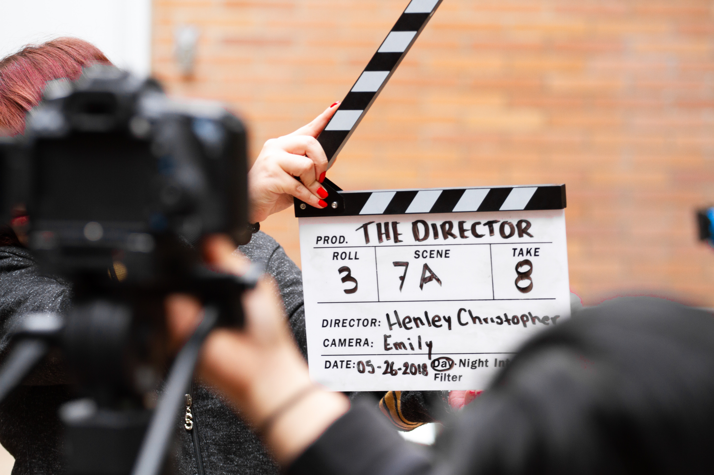

# Conceptes bàsics de vídeo digital

<figure markdown>
  
</figure>

Un vídeo és una seqüència d'imatges que es mostren a certa velocitat, de forma que les capten com a escenes en moviment continu. La producció de vídeo inclou aspectes com la gravació, el processament, l'emmagatzematge, la transmissió i la reconstrucció per mitjans electrònics.

La tecnologia de vídeo va ser desenvolupada per primera vegada per al cinema, però ha derivat en molts formats, permetent hui en dia que qualsevol persona puga dur a terme el seu propi enregistrament i puga ser vist a través de xarxes socials.

!!! info "Edició de vídeo"
    En esta unitat aprendrem a capturar vídeo des de diverses fonts mitjançant **OBS** i editar-lo per millorar el resultat utilitzant **kdenlive**. 

## Compressió
Com hem comentat abans, els vídeos són seqüències d'imatges amb àudio incorporat (i de vegades text). Així que l'arxiu resultant sol ocupar molt d'espai a disc, tarda a processar-se i transmetre's. La solució que s'aplica per mitigar estos problemes és la compressió, tant del vídeo com de l'àudio. 

La compressió pot ser:

- Temporal, en la que s'analitza un fotograma i es guarda la diferència entre un fotograma i el fotograma anterior.
- Espacial, en la que s'eliminen les dades dels píxels que no canvien en cada fotograma.

## Velocitat de transmissió (bitrate)
El bitrate defineix la quantitat d'espai físic (en bits) que ocupa un segon de durada d'un vídeo. El vídeo tindrà més qualitat com més gran siga el bitrate i l'arxiu que el conté ocuparà més. 

!!! tip "Bitrate recomanat"
    El bitrate pot ser fix o variable. El variable aconsegueix més qualitat d'imatge perquè recull més qualitat en escenes molt carregades o amb molt de moviment i estalvia en aquelles més estàtiques.

## Fotogrames per segon
Un vídeo resulta de l'exposició d'imatges o fotogrames l'un darrere l'altre. Un paràmetre de la qualitat del vídeo és el nombre de fotogrames per segon que mostra durant la reproducció. Aquest valor sol oscil·lar entre 15 i 30. Per exemple, els vídeos en DVD es reproduixen a 25 fotogrames per segon (25 fps).

!!! tip "Fotogrames per segon recomanats"
    Recomanem la gravació de vídeo a 30 fps, però si tenim problemes en l'espai que ocupa un vídeo, podem baixar fins a 10 fps, sobretot si anem a enregistrar la nostra pantalla on hi ha poc de moviment.

## Proporció o relació d'aspecte
És la proporció entre l'amplada i l'alçada d'un vídeo. Quan es reprodueix un vídeo se sol mantindre per defecte aquesta proporció per evitar deformació de les imatges. Per aquest motiu, quan es tria la visualització a pantalla completa, apareixen franges negres dalt i baix o a esquerra i dreta. 

!!! tip "Relació d'aspecte recomanada"
    És habitual una relació 4:3 per als vídeos més antics mentre que actualment se sol treballar amb ràtios de 16:9, panoràmics.

## Codificadors (còdecs)
Totes les aplicacions que graven vídeo han d'incorporar els codificadors necessaris per als formats d'eixida. Així cada aplicació quan guarda una gravació, analitzarà aquells formats de sortida que incorpora. Algunes aplicacions permeten afegir altres codificadors per ampliar la gamma de formats d'eixida.

## Descodificadors (còdecs)
Pel que fa als descodificadors, els requereixen totes les aplicacions que reprodueixen els vídeos, que estan emmagatzemats en format digital. Així no tots els reproductors permeten l'accés a tots els formats, encara que hi ha reproductors que permeten afegir descodificadors un cop instal·lat el reproductor. En el cas de l'VLC, reproductor multimèdia de software lliure àmpliament utilitzat, analitza quins còdecs falten per reproduir un vídeo i els descarrega automàticament.

## Contenidors
Un format contenidor és un tipus de format de fitxer que emmagatzema informació de vídeo, àudio, subtítols, capítols, metadades i informació de sincronització seguint un format preestablert a la seva especificació.

Alguns contenidors multimèdia són: AVI, MPG, FLV, MOV (Contenidor de QuickTime), ASF (Contenidor de WMV i WMA), Ogg, OGM, RMVB, 3GP i Matroska.

Les pistes de vídeo i àudio solen anar comprimides, sent els diferents còdecs indicats dins de cadascun dels contenidors, els encarregats de descomprimir la informació per a la seva reproducció.

Quan es crea un contenidor, en primer lloc es produeix la codificació de les pistes i posteriorment són unides (multiplexades) seguint un patró típic de cada format.

Quan un fitxer ha de ser reproduït, en primer lloc actua un divisor (splitter), el qual coneix el patró del contenidor, i «separa» (desmultiplexa) les pistes dàudio i vídeo. Un cop separades, cadascuna és interpretada pel descodificador i reproduïda simultàniament.

## Reproductors
És l'aplicació capaç de reproduir (visualitzar) el contenidor. És doncs imprescindible que el reproductor compte amb els descodificadors necessaris per reproduir tant el vídeo com l'àudio, ja que altrament la informació no pot ser interpretada de forma correcta. 

!!! tip "Reproductor recomanat"
    Com ja hem comentat, recomanem l'VLC com a reproductor.

Per poder visualitzar un vídeo necessitem tres elements el contenidor (amb el vídeo i l'àudio), el reproductor i el còdec.

## Formats de vídeo

### MP4
El format MP4 (MPEG-4) és el tipus més comú de format de fitxer de vídeo. Com a format preferit d'Apple, el MP4 pot també reproduir-se a la majoria dels altres dispositius. Pot guardar vídeo, àudio i text (normalment per a subtítols). Ofereix una definició inferior a la d'altres formats però suficient per als vídeos publicats a YouTube, Facebook, Twitter i Instagram. 

### AVI
El format AVI (Audio Video Interleave) funciona bé amb la gran majoria de reproductors i navegadors web, tant en màquines amb Windows, Mac i Linux. Desenvolupat per Microsoft, el format AVI ofereix la qualitat més alta, però a canvi d'ocupar molt d'espai al disc. És compatible amb YouTube i funciona bé per a la visualització en projectors i televisors d'alta definició.

### MOV
El format MOV (QuickTime Movie) emmagatzema vídeo, àudio i efectes d'alta qualitat, per això tendeixen a ser arxius molt grans. Desenvolupat per al reproductor QuickTime per Apple també és compatible amb la majoria de reproductors, Facebook i YouTube, funciona bé per a la visualització en projeccions d'alta qualitat.

### WMV
Els fitxers WMV (Windows Media Viewer) ofereixen bona qualitat de vídeo però produeixen arxius molt grans com MOV. Microsoft va desenvolupar WMV per al Reproductor de Windows (Windows Media Palyer). YouTube és compatible amb WMV però la compatibilitat amb reproductors no és tan elevada, necessitant de vegades abaixar códecs o reproductors adicionals.

### FLV, F4V i SWF
Els formats de vídeo Flash FLV, F4V i SWF (Shockwave Flash) estan dissenyats per a Flash Player, però es fan servir en ocasions per transmetre vídeos a YouTube. Flash ha esdevingut una tecnologia obsoleta, així que estos formats no es recomanen.

### MKV
Desenvolupat a Rússia, el format Matroska Multimedia Container és gratuït i de codi obert. És compatible amb la majoria de còdecs, però no és compatible amb molts programes. El format MKV és una opció intel·ligent si esperes que el teu vídeo es vegi en un televisor o ordinador que utilitzi un reproductor de mitjans de codi obert com VLC.

### WEBM o HTML5
Aquests formats són els millors per a vídeos incrustats a la web. Són arxius xicotets, per la qual cosa es carreguen amb molta rapidesa i es transmeten amb facilitat.

### MPEG-2
Si vols gravar el teu vídeo en un DVD, el format MPEG-2 és la millor opció.

